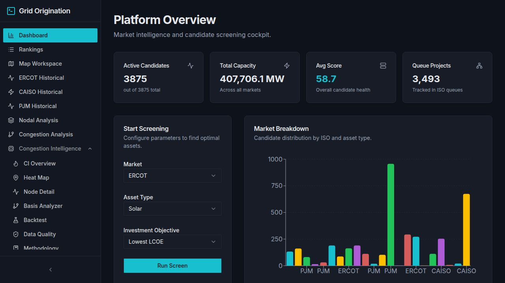

# Grid Origination Intelligence Platform

[](https://origination-intelligence-platform.replit.app/aeso/)
[](https://origination-intelligence-platform.replit.app)

> **AESO Live Demo:** https://origination-intelligence-platform.replit.app/aeso/

A power market siting and PPA origination intelligence tool built for energy procurement teams. Identifies renewable energy projects and greenfield siting opportunities across **ERCOT**, **CAISO**, and **PJM** using real market data, PyPSA optimal power flow, and an 8-dimension scoring engine.

---



> **Dashboard** — 3,875 EIA 860 projects screened in real time across three ISO markets, 407 GW total capacity tracked.

---

## AESO — Alberta Congestion Modelling

> **Live:** https://origination-intelligence-platform.replit.app/aeso/

The AESO module models congestion and pool price dynamics on the Alberta electricity grid. It includes:

| Feature | Description |
|---------|-------------|
| **Pool Price Dashboard** | Real Alberta pool prices — hourly/daily/monthly views with peak analysis |
| **Congestion Analysis** | Path-level congestion frequency, DA-RT spreads, and import/export binding |
| **3-Node PyPSA OPF** | SOUTH · CENTRAL · NORTH network with DC optimal power flow; nodal LMPs under wind/load scenarios |
| **Transmission Stress** | Upgrade scenario comparison — baseline vs. upgraded corridor capacity |
| **Scarcity Events** | High-price event detection, load shed risk by zone |
| **Market Copilot** | Natural-language interface for Alberta market questions |
| **Supply Stack** | Merit-order view of Alberta generation fleet |
| **Regulatory Feed** | Live Alberta regulatory items and policy changes |

Data sources: AESO apimgw.aeso.ca API (seeded) · PyPSA HiGHS LP solver · 21,000+ pool price rows (Jan 2024 – May 2026).

---

## What It Does

### Use Case 1 — PPA / Offtake Origination
Screen the full EIA 860 operable fleet to find wind, solar, and storage projects ready to enter Power Purchase Agreements. Each project is scored on 8 risk dimensions, ranked, and exportable for deal teams.

**Scoring dimensions:** Capture Price · Market Revenue · Interconnect Risk · RECs/Yr · Congestion Risk · Curtailment Risk · Basis Risk · Confidence Score

### Use Case 2 — New Project Siting via Queue Analysis
Analyze the interconnection queue across all three ISOs to find regions where a greenfield project can be sited with acceptable queue position, limited congestion competition, and favorable nodal basis — before committing capital to development.

---

## Key Features

| Feature | Description |
|---------|-------------|
| **EIA 860 Fleet** | 3,875 operable generators >1 MW — real 2024 data, ISO-mapped via BA codes |
| **Interconnection Queue** | 3,493 queue projects tracked across ERCOT, CAISO, and PJM |
| **PyPSA OPF Engine** | 340-bus real ERCOT network (CDR 10008) · DC OPF via HiGHS · nodal LMPs + CREZ congestion heatmap |
| **Congestion Intelligence** | 7-screen analysis suite: overview, heat map, node detail, basis analyzer, backtest, data quality, methodology |
| **Nodal Analysis** | Settlement point spread calculator with real 28-month DA/RT price history |
| **Real Price Data** | ERCOT CDR Reports 13060/13061 · CAISO OASIS PRC_LMP · 1,108 resource nodes |
| **Historical Markets** | ERCOT (15 hubs/zones), CAISO (NP15/SP15/ZP26), PJM (8 hubs/zones) |
| **Candidate Rankings** | Ranked table with all 8 scoring dimensions, sortable and filterable |
| **Map Workspace** | Leaflet map — EIA 860 project pins, queue markers, transmission lines overlay |
| **Export Center** | Top candidate cards + CSV export for deal teams |
| **Saved Screenings** | Persist filter sessions for repeatable analysis workflows |
| **Q&A Copilot** | Natural-language query interface (planned: OpenAI + DB RAG) |

---

## Pages

| Route | Purpose |
|-------|---------|
| `/` | Dashboard — stats, market breakdown, screening launcher |
| `/rankings` | Candidate rankings with all 8 dimension scores |
| `/map` | Leaflet map — project pins, queue markers, transmission lines |
| `/ercot` | ERCOT Historical — DA/RT hub and load zone price trends |
| `/caiso` | CAISO Historical — NP15/SP15/ZP26 price analysis |
| `/pjm` | PJM Historical — 8 hubs/zones, on/off-peak, YoY comparison |
| `/nodal` | ERCOT/CAISO Nodal — settlement point spread calculator |
| `/congestion` | ERCOT Congestion — DA-RT spread heatmap and node ranking |
| `/queue` | Interconnection Queue — ERCOT/CAISO/PJM project tracker |
| `/qa` | Q&A Copilot — LLM chat interface |
| `/export` | Export Center — top candidates + CSV |
| `/screenings` | Saved Screenings — saved filter sessions |
| `/guide` | Platform Guide — explains every tab and both use cases |

---

## Tech Stack

| Layer | Technology |
|-------|-----------|
| **Frontend** | React 18 · Vite · Tailwind CSS · shadcn/ui |
| **Charts** | Recharts |
| **Maps** | React Leaflet · OpenStreetMap |
| **Routing** | Wouter |
| **Data Fetching** | TanStack Query (generated hooks via Orval) |
| **API** | Express 5 · OpenAPI-first (Orval codegen) |
| **Database** | PostgreSQL · Drizzle ORM |
| **Validation** | Zod v4 · drizzle-zod |
| **Power Flow** | PyPSA · HiGHS LP solver (Python microservice) |
| **Build** | esbuild (CJS bundle) · pnpm workspaces |
| **Language** | TypeScript 5.9 · Node.js 24 |

---

## Data Sources

| Dataset | Source | Status |
|---------|--------|--------|
| ERCOT Hub/Zone prices (DA + RT) | CDR Reports 13061 + 13060 (public) | **Real** — 15 nodes × 28 months |
| ERCOT Resource nodes | ERCOT API monthly bundles (np6-905-cd RT + np4-190-cd DA) | **Real** — 1,108 nodes, 27,193 rows |
| CAISO prices (DA) | CAISO OASIS PRC_LMP (public) | **Real** — SP15/NP15/ZP26, 28 months |
| PJM prices | Calibrated to published monthly hub averages | Calibrated model |
| Interconnection Queue | CAISO ISO data (2,433 real) + ERCOT/PJM synthetic | Seeded |
| EIA 860 Projects | EIA Form 860 2024 "Operable" sheet | **Live** — 3,875 generators |
| Transmission Lines | HIFLD (115 kV+ ERCOT/CAISO/PJM, 345 kV+ national) | Seeded — 23,674 lines |

---

## AESO Market Modelling Platform

A companion module for the Alberta electricity market — live pool price tracking, regulatory intelligence, and an interactive PyPSA congestion model of the Alberta grid.

### Congestion & OPF Engine

Alberta's transmission network is dominated by a north-south constraint: renewable generation (predominantly wind and solar) sits in the **South zone**, while load centres are in the Central and North zones. When wind output is high, the SOUTH–CENTRAL corridor (2,800 MW cap) saturates — prices collapse in the South while Northern prices spike, generating congestion rent and forcing curtailment.

The platform models this with a **3-zone PyPSA DC optimal power flow** engine:

| Corridor | Capacity | Behaviour at saturation |
|----------|----------|------------------------|
| SOUTH → CENTRAL | 2,800 MW | Binds at wind CF ≥ 0.55 — South LMP collapses, curtailment rises |
| CENTRAL → NORTH | 1,400 MW | Secondary constraint — bottleneck for re-dispatch northward |

**Interactive controls** let users drag two sliders — *South Wind Capacity Factor* and *Alberta Internal Load (AIL)* — and recompute nodal LMPs across all three zones in real time using the HiGHS LP solver. The engine returns:

- **Nodal LMP per zone** ($/MWh) with shadow prices on binding line constraints
- **Wind curtailment volume** (MW) in the South zone
- **Congestion rent spread** — actual Pool Price vs unconstrained System Marginal Price (SMP)
- **Corridor loading** as a percentage of thermal limit

This makes it possible to quantify how a new renewable project at a given location will be affected by the existing transmission bottleneck — before committing development capital.

### AESO Platform Features

| Feature | Description |
|---------|-------------|
| **Live Pool Price** | Real-time AESO API feed — pool price, AIL, reserve margin, active outages |
| **3-Zone OPF Model** | PyPSA DC OPF (SOUTH / CENTRAL / NORTH) · HiGHS LP solver · interactive sliders |
| **Congestion Rent Chart** | Pool Price vs unconstrained SMP spread with corridor loading heatmap |
| **Intertie Flows** | Hourly imports/exports — BC and Saskatchewan interties |
| **Interconnection Queue** | Alberta pipeline by fuel type (Solar, Wind, Gas, Storage, Hydro) |
| **7-Day Capacity Heatmap** | Available capability as % of Maximum Capability by fuel type and hour |
| **Outage Report** | Daily and monthly forecast generation outages across the fleet |
| **REM / LMP Overview** | 2027 restructuring — Locational Marginal Pricing, scarcity cap ($3,000/MWh), FTRs |
| **AUC Regulatory Portal** | Rule 007 (power plants), Rule 028 (micro-gen), rate-setting, news feed |
| **MSA Market Surveillance** | Compliance notices, market power metrics (Lerner Index, Pivotality), monitor reports |
| **LTA Adequacy** | Quarterly supply adequacy assessments, Energy Not Served (TENS) metrics |
| **Market Copilot** | OpenAI-powered natural-language interface — executes SQL against the live DB |

---

## Architecture

```
pnpm monorepo
├── artifacts/
│   ├── grid-platform/      # React + Vite frontend
│   ├── api-server/         # Express 5 API (OpenAPI-first)
│   └── pypsa-engine/       # Python PyPSA microservice (port 8083)
├── lib/
│   ├── api-spec/           # OpenAPI YAML → codegen source of truth
│   ├── api-client-react/   # Generated TanStack Query hooks
│   ├── api-zod/            # Generated Zod schemas
│   └── db/                 # Drizzle ORM schema + migrations
└── scripts/                # Data seeding scripts (ERCOT, CAISO, EIA 860)
```

---

## Design Language

Dark navy/teal — primary `#14b8a6` teal · `#f59e0b` amber · `#8b5cf6` purple
